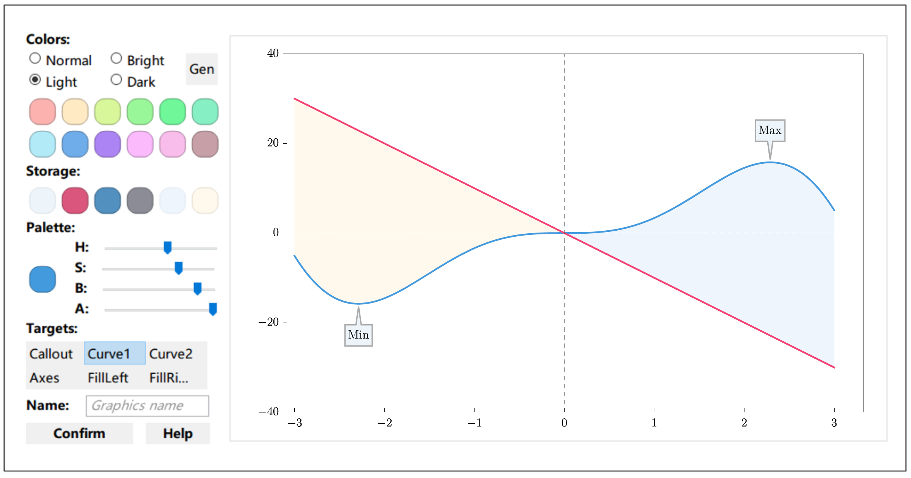

# PrettyColorize
Tools for customizing the colors of your figures in Mathematica. Based on [PrettyRandomColor](https://github.com/yuluyan/PrettyRandomColor).

# Installation
1. Install `PrettyRandomColor` following instructions [here](https://github.com/yuluyan/PrettyRandomColor#installation).
1. Open the Mathematica user application folder by `SystemOpen @ FileNameJoin[{$UserBaseDirectory, "Applications"}];`
2. Create a folder called `/PrettyColorize` and place `PrettyColorize.wl` and `/Kernel` inside.

# Usage
* Load package using ``` << PrettyColorize` ```.
* Apply `PrettyColorize` to any plotting function, e.g., Plot, ListPlot, Plot3D...

# Code example
## Minimal example
Wherever a color directive can be placed, you can instead put a `Pretty[itemName_String]` as a placeholder.
```
PrettyColorize @ Plot[x, {x, -5, 5}, PlotStyle -> Pretty["Line"]]
```

The above code generate a color palette shown below. Left-click on colors/storage changes the currently selected target item. Right-click on colors copies the clicked color to storage. Right-click on storage removes the clicked stored color.


Pressing Confirm button will generate a runnable cell that replace the `Pretty` placeholder to the selected colors:


## ContourPlot
```
PrettyColorize @
 ContourPlot[{Abs[Sin[x] Sin[y]] == 0.5, Abs[Cos[x] Cos[y]] == 0.5}, {x, -3, 3}, {y, -3, 3},
  ContourStyle -> {{Pretty["Contour1"]}, {Pretty["Contour2"], Dashed}},
  FrameTicks -> None,
  Epilog -> {
      Pretty["Points"],
      PointSize[0.025],
      Point[{{0, 0}, {\[Pi]/2, \[Pi]/2}, {-\[Pi]/2, \[Pi]/2}, {\[Pi]/2, -\[Pi]/2}, {-\[Pi]/2, -\[Pi]/2}}]
    }
 ]
```


## Plot3D
```
PrettyColorize @
 Plot3D[{x^2 + y^2, 100 Exp[-0.5 (x^2 + y^2)]}, {x, -5, 5}, {y, -5, 5},
  PlotRange -> All,
  PlotStyle -> {Pretty["Surface1"], Pretty["Surface2"]},
  Mesh -> None,
  BoxStyle -> Directive[Pretty["Box"]],
  AxesStyle -> Directive[Pretty["Box"]],
  Ticks -> None
 ]
```


## A more 'serious' example
[`MaTeX` developed by Szabolcs Horvát](https://github.com/szhorvat/MaTeX) is recommended when drawing scientific figures in Mathematica.
```
<< MaTeX`

PrettyColorize @ Plot[
  {
   Callout[(2 x)^2 Sin[x],
    MaTeX @ {"Min", "Max"},
    {Below, Above},
    Background -> Pretty["Callout"],
    FrameMargins -> 2,
    Appearance -> "Balloon"
    ],
   -10 x
  },
  {x, -3, 3},
  PlotRange -> {-40, 40},
  PlotStyle -> {{Pretty["Curve1"]}, {Pretty["Curve2"]}},
  Frame -> True,
  FrameStyle -> Black,
  FrameTicks -> {
    {Thread[{#, MaTeX @ #}] & /@ Range[-40, 40, 20], None}, {Thread[{#, MaTeX @ #}] & /@ Range[-3, 3, 1], None}
  },
  AxesStyle -> Directive[Pretty["Axes"], Dashed],
  Filling -> {1 -> {{2}, {Pretty["FillLeft"], Pretty["FillRight"]}}},
  ImageSize -> 600
 ]
```

